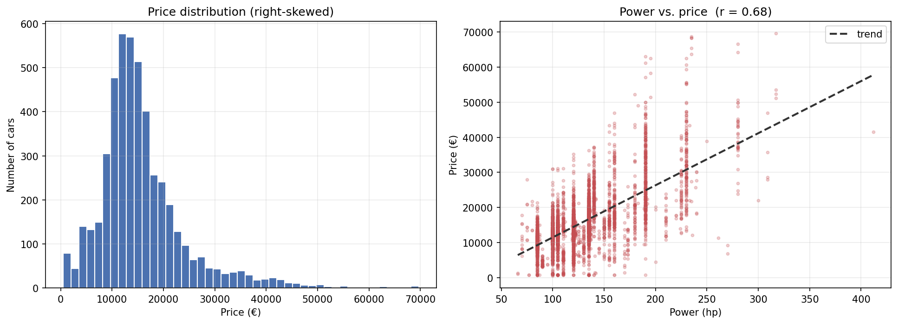

# BMW Used-Car Pricing — Data Cleaning & Preprocessing

**Turning a raw BMW used-car dataset into a clean, model-ready table.**

An end-to-end data-preparation pipeline that takes a messy BMW listings dataset — typos, mixed data types, missing values, outliers — and produces a fully cleaned, encoded, and scaled dataset ready for price-prediction modeling. The focus is a transparent, well-justified cleaning process where every drop, imputation, and transformation is explained.

<p align="center">
  
</p>

---

## Project overview

Used-car price depends on many technical and market factors, but before any model can learn them, the data has to be trustworthy. This project is the data-preparation stage of a pricing project: it inspects the raw dataset, fixes quality issues, engineers a few features, prunes redundant variables, and exports a clean table that a regression model can consume directly.

The target variable is `price`.

## Dataset

Raw dataset of **4,843 BMW listings** with 18 columns, including `model`, `km` (mileage), `power` (hp), `fuel_type`, `color`, `car_type`, `registration_date`, `sale_date`, several boolean equipment flags (air conditioning, GPS, Bluetooth, …), and `price`. Column names were translated to English at load time for consistency.

## Cleaning & preprocessing pipeline

1. **Structure inspection** — shape, dtypes, summary statistics, and a null-value audit.
2. **Cleaning**
   - Dropped duplicate records and rows with no `price` (the target).
   - Removed constant / high-null columns (`make` is always BMW; `folding_rear_seats` is mostly null).
   - Fixed literal typos (e.g. `Diesel` → `diesel`, a stray `' True'` in `gps`) and grouped rare fuel types into `other`.
   - Grouped car models representing < 1% of records into an `other` bucket to avoid a long tail of sparse categories.
   - Parsed dates and engineered `registration_year`, `sale_year`, and `days_owned` (car age at sale).
3. **Distribution review (EDA)** — histograms and box plots for numeric variables; value counts for categoricals. Price is clearly **right-skewed**.
4. **Outlier removal** — dropped implausible records: `km` outside [0, 400k], `power` ≤ 50 hp, `price` outside [500, 70k], and negative `days_owned`.
5. **Null imputation** — mode imputation for equipment flags and `car_type` *conditioned on the car model* (more faithful than a global mode), mode for `color`, and mean for the numeric date-derived fields.
6. **Encoding & scaling** — one-hot encoding for categoricals, boolean → 0/1, and min-max scaling of the numeric features.
7. **Feature pruning**
   - **Correlation** — inspected the numeric correlation matrix and dropped `days_owned` (redundant with `registration_year`) and one collinear fuel-type dummy.
   - **Variance threshold** — removed near-constant one-hot columns (99% identical) that carry no signal.
8. **Export** — the cleaned dataset (**4,788 rows × 37 columns**) is written to `data/bmw_pricing_clean.csv`, ready for modeling.

## What the data shows

From the distribution and relationship review (illustrated above):

- **Price is right-skewed** — most cars cluster in the €10k–20k range with a long tail of expensive models.
- **Power is positively related to price** (Pearson r ≈ 0.68) — more powerful cars command higher prices.
- **Mileage (`km`) is negatively related to price** — higher mileage lowers value.
- Some engineered features were redundant (`days_owned` vs. `registration_year`), which is why the correlation and variance-threshold steps matter before modeling.

## Key technical decisions

- **Model-conditioned imputation.** Missing equipment and `car_type` values are filled with the mode *within each car model*, not a single global mode, so imputed values respect what's typical for that specific model.
- **Grouping the long tail.** Rare models and fuel types are bucketed into `other`, which keeps the one-hot space compact and avoids overfitting to categories with a handful of rows.
- **Redundancy removed before modeling.** Correlation and variance-threshold checks drop features that would add multicollinearity or no signal — a cleaner input for any downstream regressor.

## Repository structure

```
.
├── data-cleaning.ipynb          # main notebook (cleaning + preprocessing)
├── images/
│   └── eda_overview.png         # price distribution + power-vs-price
├── data/
│   ├── bmw_pricing_v3.csv       # raw input
│   └── bmw_pricing_clean.csv    # cleaned output (generated by the notebook)
└── README.md
```

## Running it

```bash
pip install pandas numpy matplotlib seaborn scikit-learn openpyxl
jupyter notebook data-cleaning.ipynb
```

Place `bmw_pricing_v3.csv` in a `data/` folder next to the notebook (or adjust the path in the loading cell). Run the cells top to bottom; the notebook loads via a relative path and writes the cleaned dataset back to `data/`.

## Roadmap

1. **Regression modeling** — train and compare Linear Regression, Random Forest, and XGBoost on the cleaned dataset.
2. **Statistical significance testing** — add ANOVA for categorical variables and Pearson tests for continuous ones to formally rank predictors (p < 0.05).
3. **Feature importance** — inspect the strongest price drivers from the trained models.
4. **Cross-validation** — validate performance across folds rather than a single split.

## Tech stack

Python · pandas · numpy · matplotlib · seaborn · scikit-learn · Jupyter

## Author

Nsimba Mvinvi — Python · SQL · Statistical Analysis · Machine Learning
